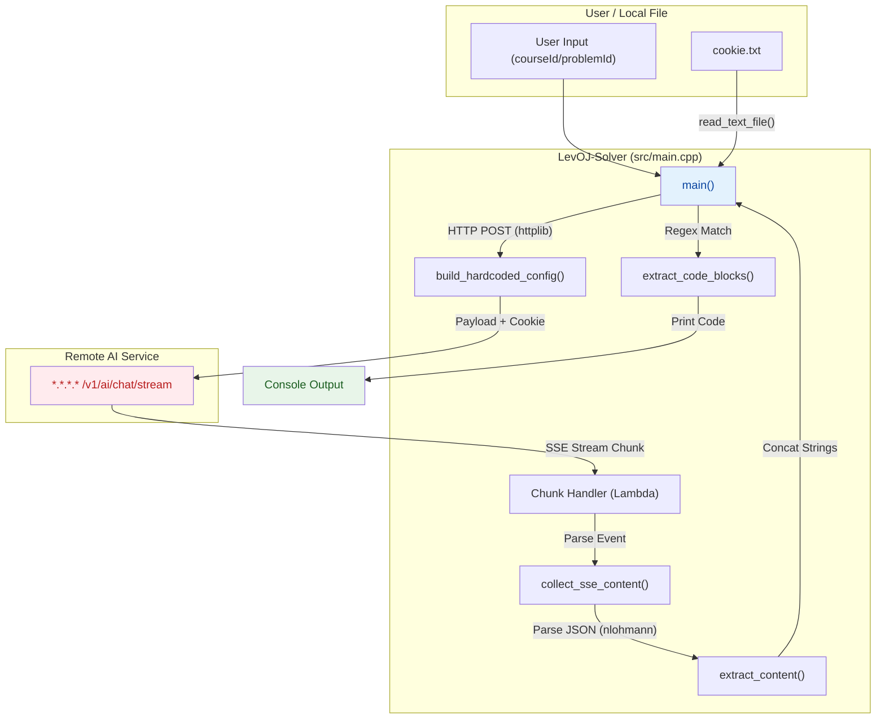

# LevOJ-Solver

> 自动获取 NUIST LevOJ 平台的AI题解, 解题思路以及当前系统提示词. 爆破提示词如开源.

## 🗺️ Visual Overview (Code & Logic Map)



## 🛠️ Tools & Dependencies

- C++ 17
- httplib
- nlohmann/json

## 🔄️ Usage

1. 获取你的 NUIST LevOJ 平台的 Cookie 并保存到 `cookie.txt` 文件中。
2. 运行 `LevOJ-Solver` 命令。
3. 根据提示输入课程 ID和问题 ID。

---
> [!NOTE]
>
> 如果你想自己编译运行

1. 克隆项目到本地.
2. 修改 `src/main.cpp` 中的 `HOST` 为合适的IP地址.
3. 修改 `src/main.cpp` 中的 `query_body` 为合适的提示词.

4. 编译并运行:
   ```
   xmake build; xmake run
   ```
